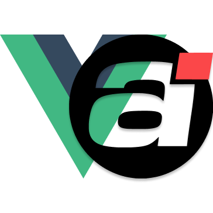

<div align="center">
  

  <h1 align="center">vue-animejs</h1>
  <p align="center">Vue 3 composables for <a href="https://animejs.com/">Anime.js</a> v4 — reactive animations that integrate naturally with Vue's reactivity system and component lifecycle.</p>
</div>

> [!WARNING]
> This library is a work in progress. The API is not stable and may change at any time.

## 🚀 Overview

**vue-animejs** wraps Anime.js v4 as idiomatic Vue 3 composables. It integrates with Vue's reactivity system — pass a `ref` as a target or option and the animation updates automatically. Lifecycle cleanup is handled for you.

**Before** — raw Anime.js in a Vue component:

```vue
<script setup lang="ts">
import { useTemplateRef, onMounted, onUnmounted } from 'vue'
import { animate } from 'animejs'

const el = useTemplateRef<HTMLElement>('el')
let animation

onMounted(() => {
  if (!el.value) {
    console.warn('Targets element is null or undefined')
    return
  }
  
  animation = animate(el.value, { translateX: 250, duration: 800 })
})

onUnmounted(() => {
  animation?.cancel()
})
</script>

<template>
  <div ref="el" />
</template>
```

**After** — with vue-animejs:

```vue
<script setup lang="ts">
import { useTemplateRef } from 'vue'
import { useAnimate } from 'vue-animejs'

const el = useTemplateRef<HTMLElement>('el')

useAnimate(el, { translateX: 250, duration: 800 })
</script>

<template>
  <div ref="el" />
</template>
```

## 📦 Requirements

- Vue 3.5+
- Anime.js 4+
- @vueuse/core 14+

## 🦄 Composables

| Composable      | Description                                       |
|-----------------|---------------------------------------------------|
| `useAnimate`    | Animate a DOM target with reactive params         |
| `useTimer`      | Drive a timer with full playback control          |
| `useTimeline`   | Sequence multiple animations on a shared timeline |
| `useAnimatable` | Create a reactive animatable object               |
| `useDraggable`  | Make a DOM element draggable with full control    |

## 🚀 Usage

### `useAnimate`

```vue
<script setup lang="ts">
import { useTemplateRef } from 'vue'
import { useAnimate } from 'vue-animejs'

const el = useTemplateRef<HTMLElement>('el')

const { play, pause } = useAnimate(el, {
  translateX: 250,
  duration: 800,
  easing: 'easeInOutQuad',
})
</script>

<template>
  <div ref="el" />
  <button @click="play">Play</button>
  <button @click="pause">Pause</button>
</template>
```

### `useTimer`

```vue
<script setup lang="ts">
import { useTimer } from 'vue-animejs'

const { play, pause } = useTimer({
  duration: 3000,
  onUpdate: (self) => console.log(self.currentTime),
})
</script>
```

### `useTimeline`

```vue
<script setup lang="ts">
import { useTemplateRef } from 'vue'
import { useTimeline } from 'vue-animejs'

const box = useTemplateRef<HTMLElement>('box')

const { add, play } = useTimeline({ loop: true })

add(box, { translateX: 100 })
add(box, { translateY: 50 }, '+=200')
play()
</script>
```

### `useAnimatable`

```vue
<script setup lang="ts">
import { useTemplateRef } from 'vue'
import { useAnimatable } from 'vue-animejs'

const el = useTemplateRef<HTMLElement>('el')

const { animatable } = useAnimatable(el, {
  x: 0,
  opacity: 1,
})
</script>
```

### `useDraggable`

```vue
<script setup lang="ts">
import { useTemplateRef } from 'vue'
import { useDraggable } from 'vue-animejs'

const el = useTemplateRef<HTMLElement>('el')

const { disable, enable } = useDraggable(el, {
  onGrab: () => console.log('grabbed'),
  onDrag: () => console.log('dragging'),
  onRelease: () => console.log('released'),
})
</script>

<template>
  <div ref="el" />
  <button @click="disable">Disable</button>
  <button @click="enable">Enable</button>
</template>
```

## 👨‍🚀 Contributors

<a href="https://github.com/juleshry/vue-animejs/graphs/contributors">
  
</a>

## 🌸 Thanks

- [Anime.js](https://animejs.com/) by [Julian Garnier](https://github.com/juliangarnier) — the animation engine powering this library
- [VueUse](https://vueuse.org/) by [Anthony Fu](https://github.com/antfu) — inspiration for composable conventions and element ref patterns

## 🧱 Contributing

See the [Contributing Guide](./CONTRIBUTING.md).

## 🗺️ TODO

- [ ] Improve exports for `useAnimatable`
- [ ] Allow reactive refs inside option objects
- [ ] Publish the first version to `npm`
- [ ] Deploy the docs website

## 📄 License

[MIT](./LICENSE.md) © 2025-present [Jules Hery](https://github.com/juleshry)